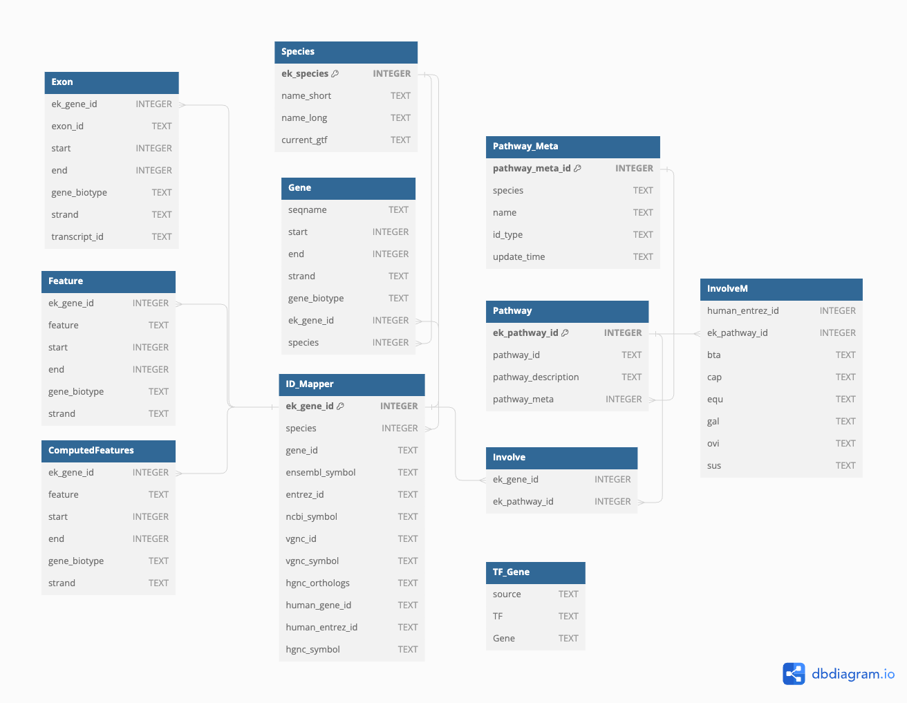

## EnrichKit DB

### Introduction

This repo contains codes for the data curation pipeline for [EnrichKit](https://github.com/liulihe954/EnrichKitWeb). We collected publicly available data set to form a portable sqlite object. Following is the database schema:

The sqlite object is available to download via [Zenodo](https://doi.org/10.5281/zenodo.10257552).

The DOI of this sqlite object is - doi.org/10.5281/zenodo.10257552

### Usage

In addition to download the sqlite object, you may replicate our process of creating such sqlite database following:

1. Clone this repo and create an conda virtual environment following `conda env create -f environment.yml`
2. Adjust the content in `config.py` and `create_db.py` to fit your purpose.
3. run `python3 create_db.py`

Note:

1. The current version is created with python3.12
2. There is a step in the process where gene ID will be compare to online information in a web-scraping style, this is an I/O bound task which are potentially time-consuming, e.g., this current version used 12 hours with 64 cores.

### Update Info & Citation

Last updated on **12/03/2023**.

Citation: `Liu, L., & Peñagaricano, F. (2023). EnrichKit: a multi-omics tool for livestock research (0.1.1) [Data set]. Zenodo. https://doi.org/10.5281/zenodo.10257552`
